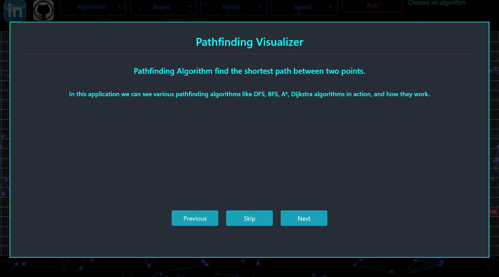
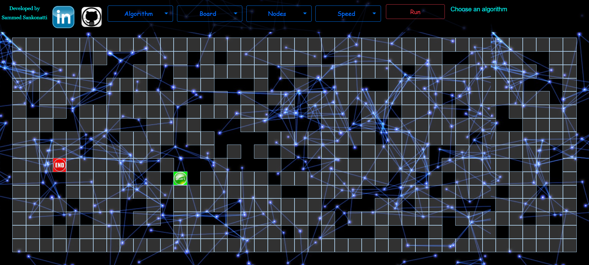
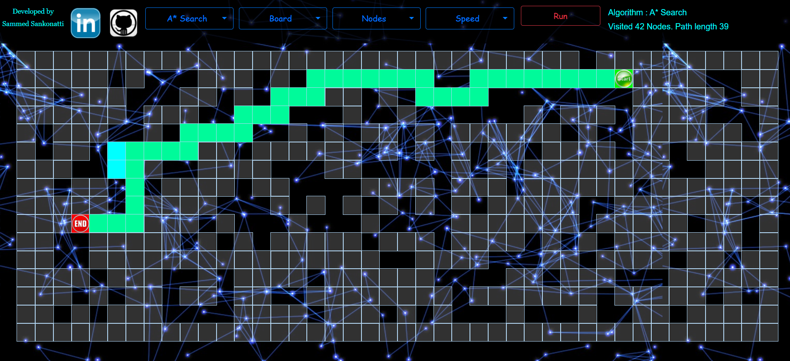
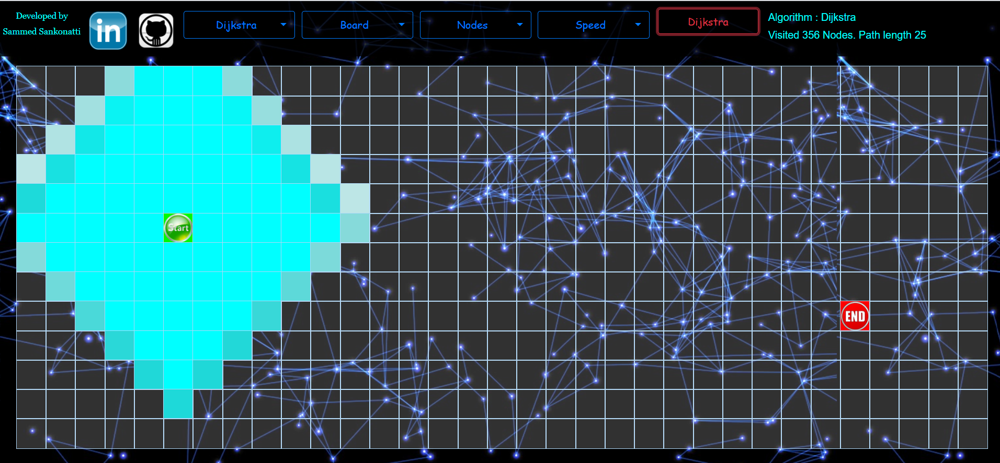

# pathfinding-visualizer
The Application for finding the shortest path between 2  nodes using various algorithms like DFS, BFS, A* etc

<h2><a href="https://sammed-sankonatti.github.io/pathfinding-visualizer/" > Live Site </a></h2>

